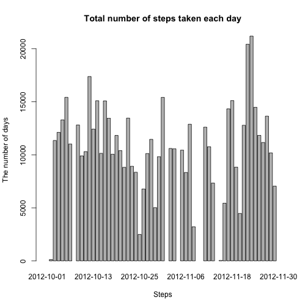
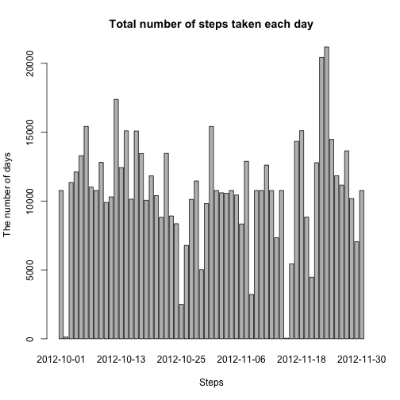

Reproducible Research: Peer Assessment 1
===========================================

This is the first assignment for the course Reproducible Research in Coursera.
I'll follow the requirements and give out the corresponding code and result below.

## Loading and preprocessing the data
First, we need to load the data and preprocess it if necessary.
We use *read.csv* function to load the data.


```r
data <- read.csv("activity.csv")
data$date <- as.Date(data$date, format = "%Y-%m-%d")
summary(data)
```

```
##      steps            date               interval   
##  Min.   :  0.0   Min.   :2012-10-01   Min.   :   0  
##  1st Qu.:  0.0   1st Qu.:2012-10-16   1st Qu.: 589  
##  Median :  0.0   Median :2012-10-31   Median :1178  
##  Mean   : 37.4   Mean   :2012-10-31   Mean   :1178  
##  3rd Qu.: 12.0   3rd Qu.:2012-11-15   3rd Qu.:1766  
##  Max.   :806.0   Max.   :2012-11-30   Max.   :2355  
##  NA's   :2304
```

Here we transform the colome *date* from *factor* to *date*.

## What is mean total number of steps taken per day?

```r
data <- read.csv("activity.csv")
step.per.day <- aggregate(data$steps, by= list(data$date), sum)
colnames(step.per.day) <- c("date", "steps")
barplot(step.per.day$steps, names.arg = step.per.day$date, 
    main = "Total number of steps taken each day", 
    xlab = "Steps", ylab = "The number of days")
```

 

Then we need to calculate the mean and the median of the steps per day.


```r
mean(step.per.day$steps, na.rm = T)
```

```
## [1] 10766
```

```r
median(step.per.day$steps, na.rm = T)
```

```
## [1] 10765
```

## What is the average daily activity pattern?
First we need to make a time series plot of the of the 5-minute interval and the average number of steps taken, averaged across all days.


```r
data.interval <- data[complete.cases(data),c(1,3)]
steps.interval <- aggregate(steps ~ interval, data = data.interval, mean)
plot(steps.interval, type = "l", xlab = "Intervals", ylab = "Steps")
```

 

Then we need to find out the interval which contains the maximum number of steps.


```r
steps.interval$interval[which.max(steps.interval$steps)]
```

```
## [1] 835
```
## Imputing missing values

First we need to calculate the the total number of rows with NAs.


```r
sum(is.na(data))
```

```
## [1] 2304
```

Then we need to derive a strategy to fill the NAs. 
As is often used in smoothing data, we will use the mean for the interval to fill the blanks.


```r
new.data <- merge(data, steps.interval, by = "interval", suffixes = c(".per",".mean"))
new.data <- new.data[order(new.data$date, new.data$interval),]
na.index <- is.na(new.data$steps.per)
new.data$steps.per[na.index] <- new.data$steps.mean[na.index]
new.data <- new.data[, c(1:3)]
names(new.data) <- c("interval", "steps", "date")
head(new.data)
```

```
##     interval   steps       date
## 1          0 1.71698 2012-10-01
## 63         5 0.33962 2012-10-01
## 128       10 0.13208 2012-10-01
## 205       15 0.15094 2012-10-01
## 264       20 0.07547 2012-10-01
## 327       25 2.09434 2012-10-01
```

Next we create a histogram and calculate the mean and median as in Question 1.


```r
step.per.day.new <- aggregate(new.data$steps, by= list(new.data$date), sum)
colnames(step.per.day.new) <- c("date", "steps")
barplot(step.per.day.new$steps, names.arg = step.per.day.new$date, 
    main = "Total number of steps taken each day", 
    xlab = "Steps", ylab = "The number of days")
```

 

```r
mean(step.per.day.new$steps, na.rm = T)
```

```
## [1] 10766
```

```r
median(step.per.day.new$steps, na.rm = T)
```

```
## [1] 10766
```

We can see that the plot has no blank colomns now, but the mean and median almost stay the same.
This means that this is an effective way to smooth the data.

## Are there differences in activity patterns between weekdays and weekends?

First we need a new colomn in the new data that indicates the weekday of a date.
We can write a function here in order to use the *sapply* function.


```r
convert_weekday <- function(date) {
  if(weekdays(as.Date(date)) %in% c("Saturday", "Sunday")) {
    return("weekend")
  }
  else {
    return("weekday")
  }
}
```

Now we can easily create a new column.


```r
new.data$weekday <- as.factor(sapply(new.data$date, convert_weekday))
head(new.data,5)
```

```
##     interval   steps       date weekday
## 1          0 1.71698 2012-10-01 weekday
## 63         5 0.33962 2012-10-01 weekday
## 128       10 0.13208 2012-10-01 weekday
## 205       15 0.15094 2012-10-01 weekday
## 264       20 0.07547 2012-10-01 weekday
```

Then we need to make a panel plot containing a time series plot of the 5-minute interval and the average number of steps taken, averaged across all weekday days or weekend days.


```r
par(mfrow = c(2,1))
for(days in names(table(new.data$weekday))) {
  step.interval.mean <- NULL
  step.interval.mean <- aggregate(steps ~ interval, data = new.data, subset = (new.data$weekday == days), FUN = mean)
  plot(step.interval.mean, type = "l", xlab = "Intervals", ylab = "Steps", main = days)
}
```

 
